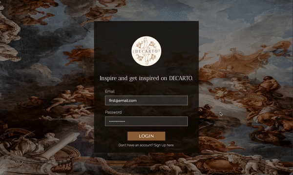

# DECARTO - Social Media Webapp

A MERN stack social media which enables artists and creative people to share their work and get inspired by others. Application is designed to be fully responsive while also offering dark and light mode features to cater to diverse user preferences. Key functionality consists of authentication, authorisation and a range of user interactions, including likes, following, creating posts, and beyond.

## Technologies 

 - JavaScript
 - React
 - Redux
 - Node.js
 - Express
 - CSS/Sass
 - MongoDB

## Media

    
    
    

